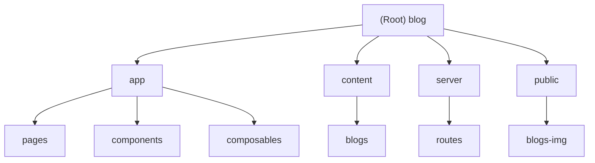

# Change Log (Changelog)

- 2026-05-02T16:50:53: 执行增量深挖更新，覆盖 `app/pages`、`content/blogs`、`server/routes` 的高信号文件；按路径索引 `public/blogs-img` 相关引用；记录 `app/components` 与 `app/composables` 的枚举限制和后续补扫建议。
- 2026-05-02T16:37:48: 初始化项目 AI 上下文；建立根级架构说明、模块索引、运行/测试规范与可恢复扫描记录。

# 项目愿景

这是一个基于 Nuxt 4、Vue、Nuxt Content 与 Tailwind CSS 的个人博客站点，面向强化学习、深度学习、Agentic AI、Linux 折腾记录与个人学术主页内容发布。站点目标是以静态/预渲染优先的方式提供可搜索、可分类、带 SEO/OG/RSS 能力的个人知识库。

# 架构概览

- 技术栈：Nuxt 4、Vue SFC、TypeScript、Nuxt Content、Tailwind CSS、Nuxt Image/Icon、Nuxt Sitemap/Robots/OG Image、Fuse.js、KaTeX。
- 应用入口：`nuxt.config.ts` 配置全局模块、SEO、预渲染、内容 Markdown 处理与深色模式；`app/app.vue` 负责全局 head、布局与页面渲染。
- 页面系统：`app/pages/index.vue`、`app/pages/blogs/index.vue`、`app/pages/categories/index.vue`、`app/pages/about.vue` 分别提供首页、归档搜索、标签聚合与个人主页。
- 内容系统：`content.config.ts` 将 `content/**/*.md` 注册为 Nuxt Content collection，并接入 sitemap、robots 与 OG image 元数据；当前深挖确认 `content/blogs` 中包含 transformer、PPO、zsh、Agent、OpenMP 五篇文章。
- 静态资源：`public/**` 直接以站点根路径公开；博客 frontmatter 引用 `/blogs-img/blog1.jpg`、`/blogs-img/blog2.jpg`、`/blogs-img/blog3.jpg`、`/blogs-img/blog4.jpg`，正文相对图片对应 `public/transformer/**` 与 `public/zsh/**`。
- 服务端接口：`server/routes/rss.xml.ts` 基于 Nuxt Content 生成 RSS XML，并在 `nuxt.config.ts` 中参与预渲染。
- 质量工具：`eslint.config.mjs` 接入 Nuxt ESLint，`prettier` 通过 package scripts 执行格式检查；未发现独立测试体系。

# Module Structure Diagram (Mermaid)

# Module Index

| 模块 | 职责 | 入口/关键文件 | 测试状态 | 文档 |
|---|---|---|---|---|
| `app` | Nuxt 前端应用、页面路由、布局、组件、组合式逻辑、站点元数据与类型定义。 | `app/app.vue`, `app/pages/index.vue`, `app/pages/blogs/index.vue`, `app/pages/categories/index.vue`, `app/pages/about.vue`, `app/data/index.ts` | 未发现专用测试目录；建议补充搜索分页、标签聚合、关键页面 smoke test。 | `app/CLAUDE.md` |
| `content` | Markdown 博客内容与文章 frontmatter 数据源。 | `content/blogs/*.md`, `content.config.ts` | 未发现内容校验测试；建议补充 frontmatter/schema、图片引用和日期格式检查。 | `content/CLAUDE.md` |
| `server` | Nuxt/Nitro 服务端路由，当前负责 RSS feed。 | `server/routes/rss.xml.ts` | 未发现服务端测试；建议补充 RSS 生成快照或集成测试。 | `server/CLAUDE.md` |
| `public` | 静态资源、头像、博客图片、favicon 等公开资产。 | `public/**`, `public/blogs-img/**` | 未发现资产完整性检查；建议补充引用路径检查和未引用资源检查。 | `public/CLAUDE.md` |

# Running and Development

- 安装依赖：`npm install` 或与现有 lockfile/包管理器保持一致。
- 开发服务：`npm run dev`。
- 构建：`npm run build`。
- 静态生成：`npm run generate`。
- 预览：`npm run preview`。
- 依赖准备：`npm run postinstall` 执行 `nuxt prepare`。
- 质量检查：`npm run lint`、`npm run format`。

# Testing Strategy

当前未在已扫描范围内发现独立单元测试、集成测试或 E2E 测试目录。现阶段建议以以下顺序补齐验证：

1. 使用 `npm run lint` 和 `npm run format` 作为基础质量门禁。
2. 使用 `npm run build` 或 `npm run generate` 验证 Nuxt、内容集合、RSS、OG、sitemap 与预渲染链路。
3. 为 `/blogs` 的 Fuse 搜索、分页边界和空结果状态增加单元测试。
4. 为 `/categories` 的 tags 聚合逻辑增加测试，尤其是缺失或非数组 `meta.tags` 的容错。
5. 为 `server/routes/rss.xml.ts` 增加 RSS XML smoke test、日期解析异常测试和 base URL 一致性检查。
6. 为 `content/blogs` 增加 frontmatter 必填字段、图片引用存在性、外链格式和 `published` 布尔值检查。

# Coding Standards

- TypeScript 严格模式由 `nuxt.config.ts` 的 `typescript.strict` 启用。
- Vue 组件使用 `<script setup>` 风格；组件、页面和 composable 遵循 Nuxt 自动导入约定。
- 样式以 Tailwind CSS utility class 为主，必要时使用 scoped CSS；`app/pages/about.vue` 还包含页面级 scoped 与非 scoped 样式。
- Markdown 文章应包含一致 frontmatter：`title`, `date`, `description`, `image`, `alt`, `ogImage`, `tags`, `published`。
- 修改站点 SEO、作者信息、社交链接时优先检查 `app/data/index.ts`、`app/pages/about.vue` 与 `nuxt.config.ts`。
- 修改文章图片时同步检查 `content/blogs` 中 Markdown/frontmatter 引用与 `public/blogs-img` 资产路径。

# AI Usage Guidelines

- 不要修改源代码或文章内容，除非用户明确要求；本上下文维护仅允许写入 `CLAUDE.md` 与 `.claude/index.json`。
- 新增博客文章前先检查 `content.config.ts` 的 collection 规则与现有 frontmatter 风格。
- 修改 UI 或路由时优先阅读 `app/pages`, `app/components`, `app/layouts`, `app/data`。
- 修改 RSS、sitemap、robots、OG image 时优先阅读 `nuxt.config.ts`, `content.config.ts`, `server/routes/rss.xml.ts`。
- 对二进制/大文件资源只记录路径与用途，不直接读取内容。
- 当前已枚举 `app/components`、`app/composables`、`content/blogs` 与 `public/blogs-img`；后续深挖可优先检查组件职责、图片引用存在性和内容质量自动化。
